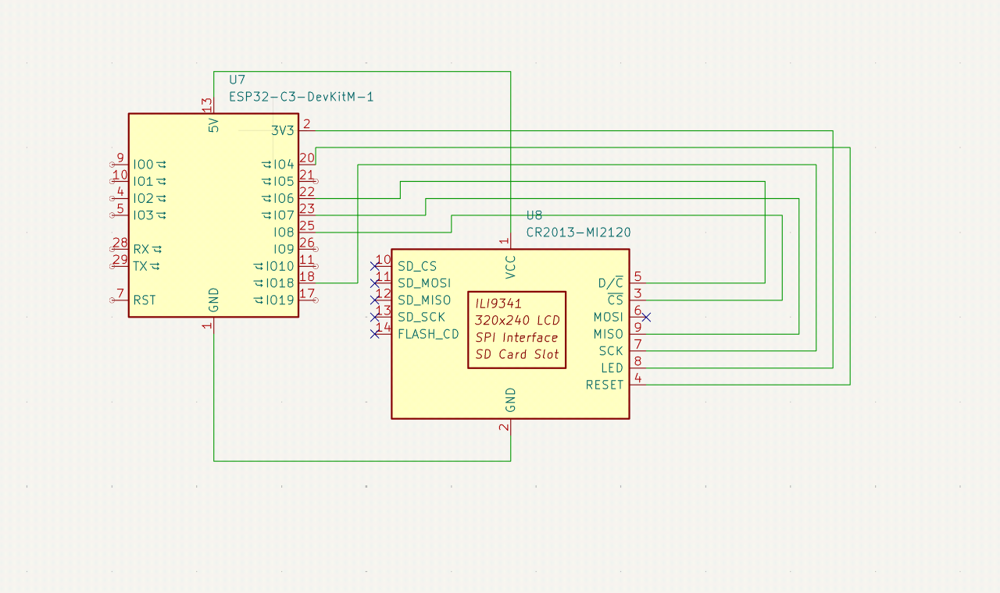

# Smart Cat Collar
I initially was gonna make this as a prototype for a business class presentation (shark tank assignment)! I realized, hey, its free Stasis points if I document everything, and document it all I did

## Process
I started off by just finding ways to mount the tft display and ESP32 on a collar, which was actually a challenge cause how do you fit dupont wires without looking weird? No worries, I found it out eventually. After I cadded it, I just printed it and "assembled" (its literally 4 screws) it, coded it, and voila.

Coding was the hard part lowkey, figuring out all the dependencies for a TFT screen was a little complicated, and finding out what I even had (it was an impulsebuy from Aliexpress) was another hassle, all is good. 

After that, I had to figure out how to store images, after losing my sanity trying to use an SD card I just realized I can store the entire image as an array and optimizations galore.

## Cad

## Wiring

## Build

Cool Video!

https://github.com/user-attachments/assets/fbcae221-1832-4e88-91b6-53feda09a32c

Hehe silly kitty :3

## BOM
|Part          |Amount|Link                                                                                                         |Cost     |
|--------------|------|-------------------------------------------------------------------------------------------------------------|---------|
|ESP32         |1     |https://www.aliexpress.com/item/1005006825727330.html                                                        |$6.73    |
|TFT Display   |1     |https://www.aliexpress.com/item/1005008042359126.html                                                        |$5.59    |
|3DP Mount     |1     |N/A                                                                                                          |Negligble|
|Strap         |1     |N/A                                                                                                          |N/A      |
|C-C Cable     |1     |https://www.bestbuy.ca/en-ca/product/logiix-sync-charge-shortie-0-3m-1-ft-usb-c-to-usb-c-cable-white/19273876|$6.99    |
|Mini Powerbank|1     |https://www.mophie.com/products/powerstation-mini-gen-1                                                      |$39.95   |
