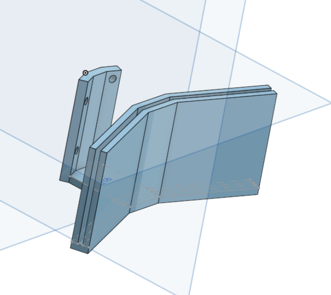
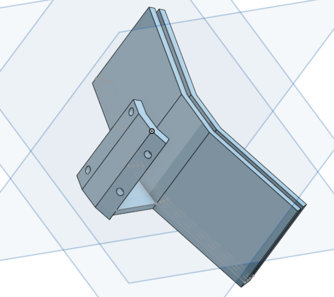
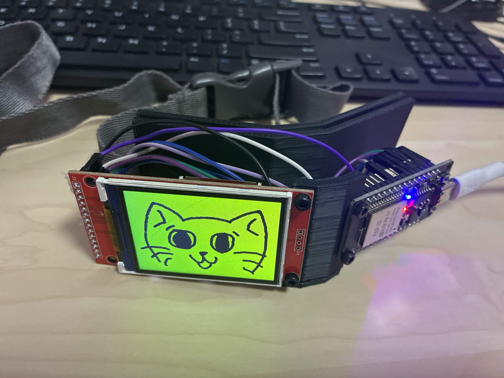

# Smart Cat Collar
I initially was gonna make this as a prototype for a business class presentation (shark tank assignment)! I realized, hey, its free Stasis points if I document everything, and document it all I did

## Process
I started off by just finding ways to mount the tft display and ESP32 on a collar, which was actually a challenge cause how do you fit dupont wires without looking weird? No worries, I found it out eventually. After I cadded it, I just printed it and "assembled" (its literally 4 screws) it, coded it, and voila.

Coding was the hard part lowkey, figuring out all the dependencies for a TFT screen was a little complicated, and finding out what I even had (it was an impulsebuy from Aliexpress) was another hassle, all is good. 

After that, I had to figure out how to store images, after losing my sanity trying to use an SD card I just realized I can store the entire image as an array and optimizations galore.

## Cad

## Build

Cool Video!
[My video - Date.webm](https://github.com/user-attachments/assets/8224e2fc-8e21-40b7-af85-943a2465e463)

Hehe silly kitty :3
